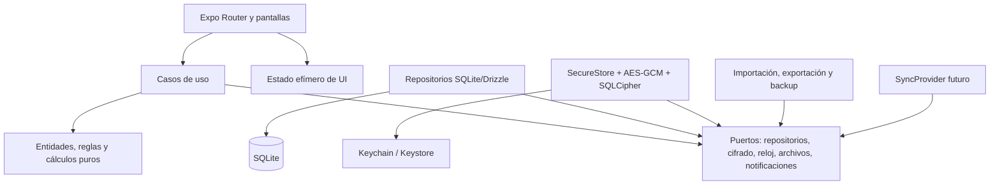
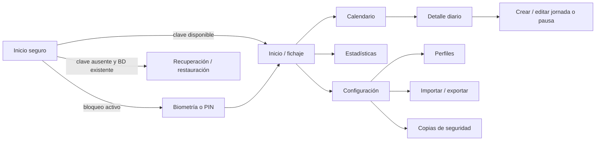

# Arquitectura y navegación — Fase 1

## Objetivos y límites

La aplicación será local-first, offline-first y privacy-first. SQLite será la fuente de verdad; el estado global solo contendrá estado efímero de interfaz, sesión de desbloqueo y preferencias de presentación. El MVP no dependerá de red ni de un backend.

Esta fase define el sistema. No contiene implementación de producto.

## Arquitectura recomendada

Se adopta una arquitectura modular por funcionalidad con dependencias dirigidas hacia el dominio:



Reglas de dependencia:

1. `domain` no importa React Native, Expo, SQLite ni bibliotecas visuales.
2. Los casos de uso dependen de interfaces, no de implementaciones nativas.
3. Los repositorios traducen filas cifradas a entidades de dominio.
4. Los componentes no calculan totales ni escriben SQL.
5. Las operaciones de entrada/salida, pausa, edición e importación son transacciones atómicas.
6. La base de datos es la fuente de verdad; Zustand no duplica historiales.

## Estructura prevista

```text
app/                         # rutas Expo Router; composición mínima
src/
  features/
    time-tracking/           # inicio, entrada/salida y pausas
    calendar/                # mes y detalle diario
    reports/                 # estadísticas
    imports/                 # validación y previsualización
    exports/                 # CSV/XLSX/PDF y compartir
    settings/                # preferencias y bloqueo
    profiles/                # perfiles laborales
    backups/                 # copia/restauración cifrada
  domain/
    entities/
    calculations/
    anomalies/
    services/
  database/
    schema/
    migrations/
    repositories/
  security/
    encryption/
    key-management/
    app-lock/
  sync/                      # contratos, sin proveedor en el MVP
  shared/
    components/
    hooks/
    validation/
    errors/
    i18n/
    time/
tests/
  unit/
  integration/
  components/
  e2e/
```

## Puertos principales

- `WorkSessionRepository`: consultas paginadas y por rango, jornada abierta, escritura transaccional y borrado lógico.
- `ProfileRepository`, `DayClassificationRepository`, `RevisionRepository`, `SettingsRepository`.
- `UnitOfWork`: delimita transacciones para fichajes, ediciones, importación y restauración.
- `EncryptionProvider`: cifra/descifra versiones de sobres; nunca expone claves a presentación.
- `KeyManager`: crea, carga, rota e invalida el llavero local.
- `Clock`: instante UTC monotónicamente observado y zona IANA del dispositivo; permite pruebas deterministas.
- `NotificationScheduler`, `ExportWriter`, `BackupProvider`.
- `SyncProvider`: `push(changes)`, `pull(cursor)`, `resolve(conflict)` y gestión de dispositivos; su implementación MVP será `DisabledSyncProvider`.

## Concurrencia e idempotencia

El botón principal se deshabilita mientras el caso de uso está pendiente, pero la protección real vive en SQLite:

- índice único parcial para una jornada activa por perfil;
- transacción `BEGIN IMMEDIATE` para abrir/cerrar una jornada;
- identificador de operación UUID para reintentos idempotentes;
- lectura posterior a escritura para devolver el estado confirmado.

Así, dos pulsaciones o dos tareas concurrentes no crean fichajes duplicados.

## Flujo de navegación



La navegación principal tendrá pestañas Inicio, Calendario, Estadísticas y Configuración. Exportación, detalle y edición serán rutas apiladas. El fichaje permanecerá a una sola acción desde Inicio.

## Estrategia de interfaz y accesibilidad

- Controles táctiles de al menos 44×44 pt; acción principal mayor y accesible con una mano.
- Etiquetas y estados semánticos para lector de pantalla; no se comunicará estado solo por color.
- Soporte de fuente aumentada, pantalla pequeña, modo claro/oscuro y reducción de movimiento/transparencia.
- El contador será un componente aislado; deriva `ahora - startedAtUtc` y no escribe cada segundo.
- Calendario por mes e historiales virtualizados y paginados.
- La pantalla de fichaje carga primero la sesión activa y el resumen de hoy; estadísticas históricas se difieren.

## Internacionalización y tiempo

Todos los instantes persistidos serán UTC ISO-8601 o epoch milisegundos con su zona IANA capturada. Las fechas civiles se calculan con la zona del perfil, nunca con offsets fijos. Los textos usarán claves de traducción desde el primer componente; español será el idioma inicial.

Los cambios manuales del reloj no alteran registros ya escritos. Si el reloj observado retrocede o la zona cambia durante una sesión, la sesión se conserva y se marca para revisión.
